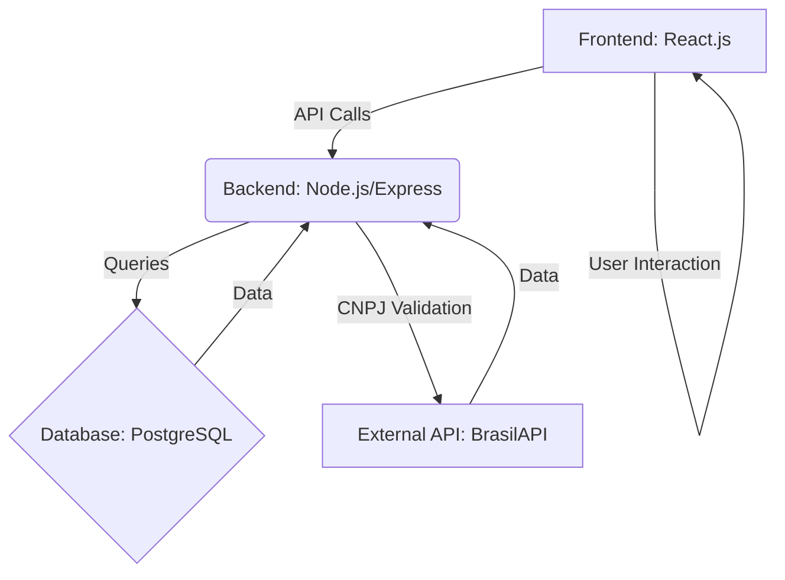

## Architecture Diagram

## System Components

### Frontend (React.js)

- User interface for buyers and suppliers
- Interactive product catalog and search
- Quote comparison dashboard
- Order tracking interface
- Company verification portal

### Backend (Node.js/Express)

- RESTful API endpoints
- Authentication and authorization
- Business logic processing
- File upload handling
- Rate limiting and security middleware

### Database (PostgreSQL)

- User and company data
- Product catalog
- Orders and quotations
- Audit trails and logs

### External Services

- BrasilAPI for CNPJ validation
- Payment processing integration
- Email notification services
